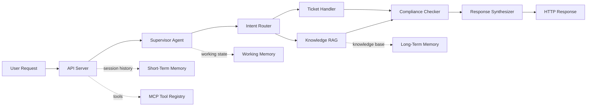

# Smart CS Agent Go

一个用 Go + Gin 写的智能客服多 Agent 原型项目。

它不是单文件 demo，而是一个带有编排层、记忆层、工具层、合规层和基础可观测性的服务骨架，适合放在 GitHub 作为作品集展示，也适合继续往生产系统演进。

## 作品集亮点

- 分层清晰：入口、API、Supervisor、子 Agent、记忆层、MCP 工具、tracing 都已拆开
- 可演示完整链路：用户消息进入后，会经历意图识别、路由、合规检查和结果拼装
- 有“能跑起来”的基础设施：配置、健康检查、就绪检查、日志、指标、Docker、Makefile
- 有“能继续扩展”的接口：短期记忆支持 Redis，工作记忆和工单支持本地持久化，MCP 工具已注册化
- 有测试兜底：单测和 API 集成测试都已经补上

## 核心能力

| 模块 | 作用 |
| --- | --- |
| 意图路由 | 根据用户消息判断是知识问答还是工单处理 |
| 知识检索 | 从长期知识库里检索政策、流程、FAQ |
| 工单处理 | 为需要人工介入的请求生成工单 |
| 合规检查 | 对敏感词和 PII 做基础风险拦截 |
| 短期记忆 | 保存会话历史，支持 Redis 和本地文件兜底 |
| 工作记忆 | 保存当前会话的中间状态与历史 |
| MCP 工具 | 提供工具注册表和列表接口 |
| 可观测性 | 记录 request id、请求日志、基础指标 |

## 架构



## 技术栈

- `Go 1.22+`
- `Gin`
- `Redis` 作为可选短期记忆后端
- `Docker`
- `Go test`
- `MCP` 风格工具注册

## 快速开始

### 环境变量

- `PORT`：HTTP 端口，默认 `8090`
- `DATA_DIR`：数据目录，默认 `./data`
- `REDIS_URL`：可选，用于短期记忆持久化
- `API_KEY`：可选，设置后请求需要携带 `X-API-Key` 或 `Authorization: Bearer`
- `APP_ENV`：运行环境，默认 `dev`
- `REQUEST_TIMEOUT`：请求超时，默认 `30s`
- `SHUTDOWN_TIMEOUT`：关闭超时，默认 `10s`

### 本地运行

```bash
go mod download
go run .
```

### 常用命令

```bash
make fmt
make test
make build
make run
```

### Docker

```bash
docker build -t smart-cs-agent .
docker run -p 8090:8090 -e DATA_DIR=/data -v $(pwd)/data:/data smart-cs-agent
```

## 接口

### `POST /api/chat`

```bash
curl -X POST http://localhost:8090/api/chat \
  -H "Content-Type: application/json" \
  -d '{"message":"我想退款","user_id":"u1"}'
```

### `GET /api/history/:sessionId`

返回某个会话的消息历史。

### `GET /api/tools`

返回当前注册的 MCP 工具列表。

### `GET /api/metrics`

返回基础 Agent 指标和请求统计。

### `GET /health`

服务健康检查。

### `GET /ready`

服务就绪检查。

## 项目文件

- [main.go](main.go)
- [api/server.go](api/server.go)
- [agent/supervisor.go](agent/supervisor.go)
- [memory/short_term.go](memory/short_term.go)
- [memory/working_memory.go](memory/working_memory.go)
- [mcp/server.go](mcp/server.go)
- [tracing/tracer.go](tracing/tracer.go)

## 当前状态

- 已完成本地可运行版本
- 已完成 GitHub 发布
- 已完成 README、Makefile、`.env.example`、`.gitignore`
- 已完成基础测试和构建验证

## 还能继续往前走的方向

- 接真正的向量检索和 embedding
- 接真实工单系统和数据库
- 补鉴权、RBAC 和审计
- 接 Prometheus / OpenTelemetry
- 补端到端测试和 CI

## 验证

```bash
go fmt ./...
go test ./...
go build ./...
```
